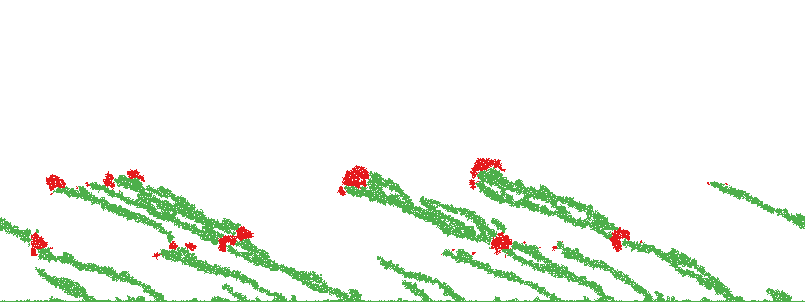

# GLADMonteCarlo-public

Files for the simulation of heterostructure GLAD film deposition. These files are the I can publish (methods that are discussed in our paper); the other files (simulations, data, images, reports) cannot be published. To preserve compatibility and understanding with other researchers I haven't renamed these to be more reasonable but I hope to do so soon. The method is described in our paper.

Three types of simulation can be performed:
* 3D in discrete space (Monte_Carlo_column, Simulation3DNoPBC)
* 3D in real space (ContinuumSimulation3D, ContinuumSimulation3DFast)
* 2D in discrete area (Simulation2D)

There are a few tools and notebooks I created to better visualize the simulations. The pptk was used for fast visualization, particularly for discrete space, while Open3D was used for nicer images, particularly in real space. (point_cloud_visualization) PyVista was tested and some vetiges remain but it largely covered the same ground as Open3D.

Several of these tools were never completely finished but perhaps somebody else will be able to use them.

If you use any of this, please cite our paper. It is in preparation so I do not have the citation ready yet; please let me know. I'll update as soon as it is ready.

